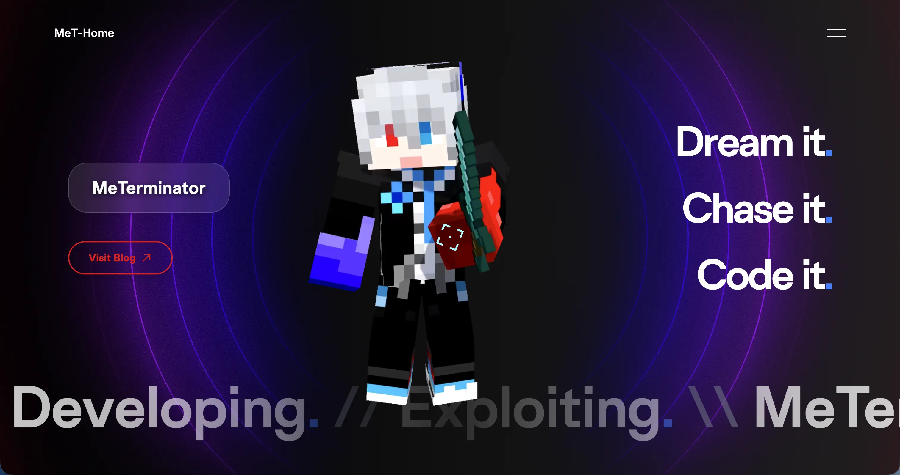
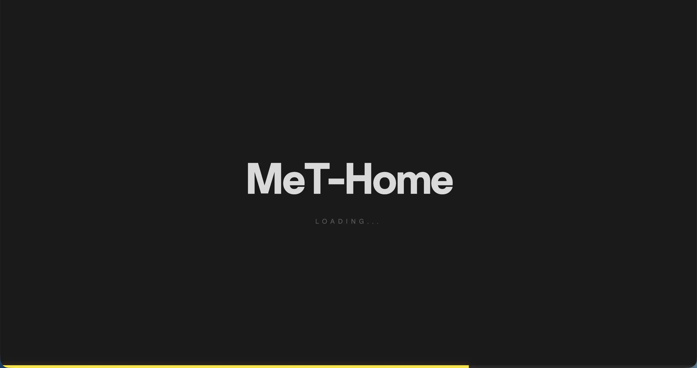
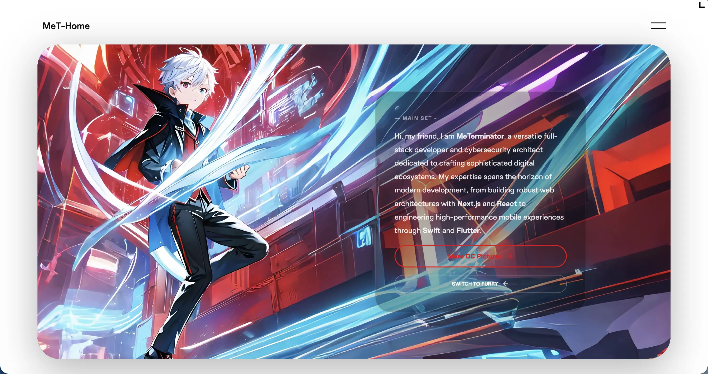
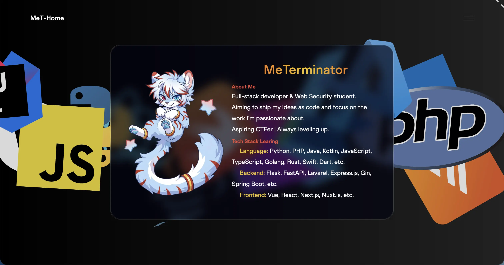
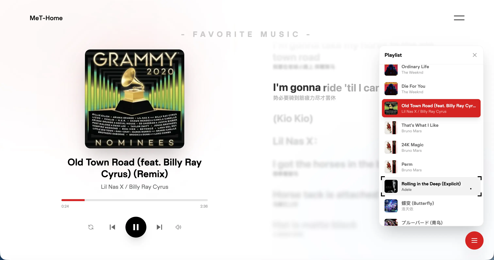
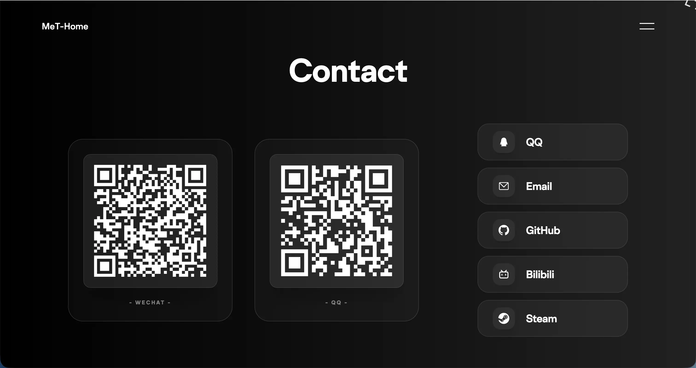
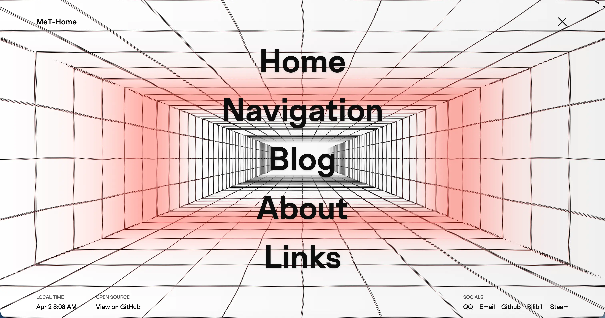

# MeT's Portfolio (MeT-Home)

<p align="center">
  
</p>

<p align="center">
  <a href="https://github.com/MeTerminator/met-home/blob/main/LICENSE">
    
  </a>
  <a href="https://github.com/MeTerminator/met-home/stargazers">
    
  </a>
  <a href="https://github.com/MeTerminator/met-home/network/members">
    
  </a>
</p>

<p align="center">
  <a href="https://met6.top/" target="_blank">
    MeT-Home
  </a>
</p>

---

## 🎨 Project Overview

**MeT-Home** is an immersive, interactive personal homepage for MeTerminator. Built with **Vue 3**, **TypeScript**, **Three.js**, and **GSAP**, it offers a physically elastic scrolling experience, breathtaking 3D visuals, and deep personalization.

---

## ✨ Core Features

- 🚀 **Extreme Fluidity**: Leverages `fullpage.js` and `GSAP` for physics-based elastic scrolling and custom section transitions.
- 🎹 **Music Section**: Integrated [applemusic-like-lyrics](https://github.com/amll-dev/applemusic-like-lyrics) for an audiophile-ready experience.
- 📱 **Cross-Platform Perfect**: Optimized for everything from ultra-wide monitors to mobile devices with a meticulously crafted responsive design.
- 📦 **PWA Ready**: Offline support, installable home screen icon, and rapid launch times.

---

## 📸 Visual Preview

|  |  |  |
| :---: | :---: | :---: |
|  |  |  |

---

## 🛠️ Tech Stack

### Core Frameworks
- **Framework**: [Vue 3](https://vuejs.org/) (SFC + Script Setup)
- **Language**: [TypeScript](https://www.typescriptlang.org/)
- **Build Tool**: [Vite 8](https://vitejs.dev/)

### Motion & Visuals
- **Animation Hub**: [GSAP](https://greensock.com/gsap/) (GreenSock Animation Platform)
- **3D Engine**: [Three.js](https://threejs.org/)
- **Smooth Interaction**: [Motion-V](https://motion-v.com/) & [Lenis](https://github.com/darkroomengineering/lenis)
- **Typography**: [Split-type](https://github.com/lukePeavey/SplitType) & [ScrambleText]

### UI & Utilities
- **Styles**: [Tailwind CSS 4.0](https://tailwindcss.com/)
- **Interaction**: `face-api.js`, `vue-fullpage.js`, `@applemusic-like-lyrics/vue`
- **State Management**: [VueUse](https://vueuse.org/)

---

## 🚀 Quick Start

### 1. Clone the repository
```bash
git clone https://github.com/MeTerminator/met-home.git
cd met-home
```

### 2. Install dependencies
Recommended to use `pnpm`:
```bash
pnpm install
```

### 3. Start development server
```bash
pnpm dev
```

### 4. Build for production
```bash
pnpm build
```

---

## 📄 License

This project is licensed under the **AGPL-3.0** License. Open-source is for everyone, but please respect the terms and provide attribution.

---

<p align="center">
  Made with ❤️ by <a href="https://github.com/MeTerminator">MeTerminator</a>
</p>
